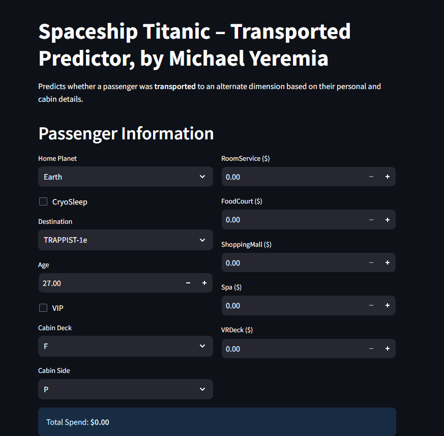
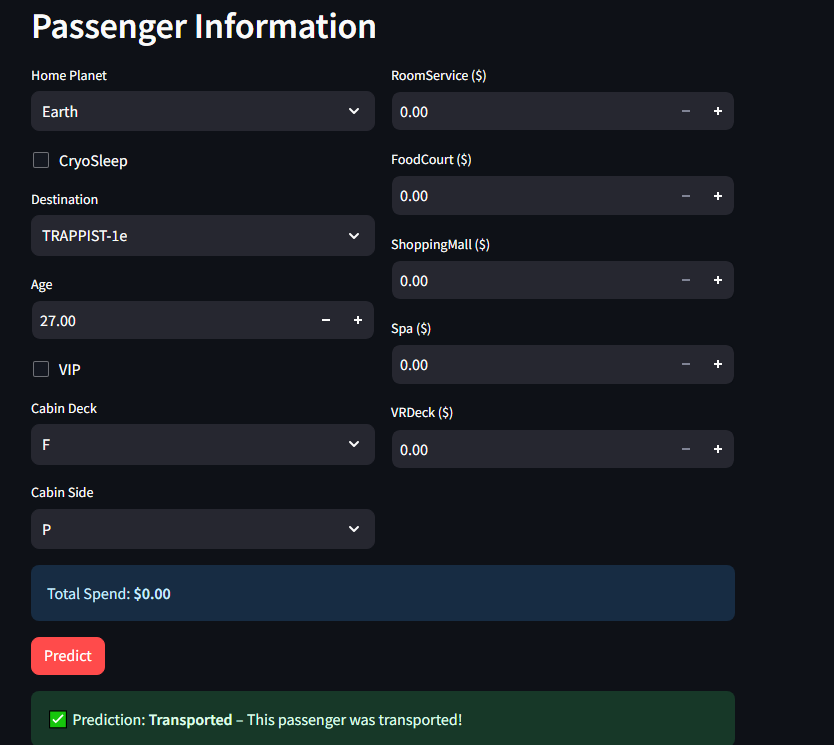
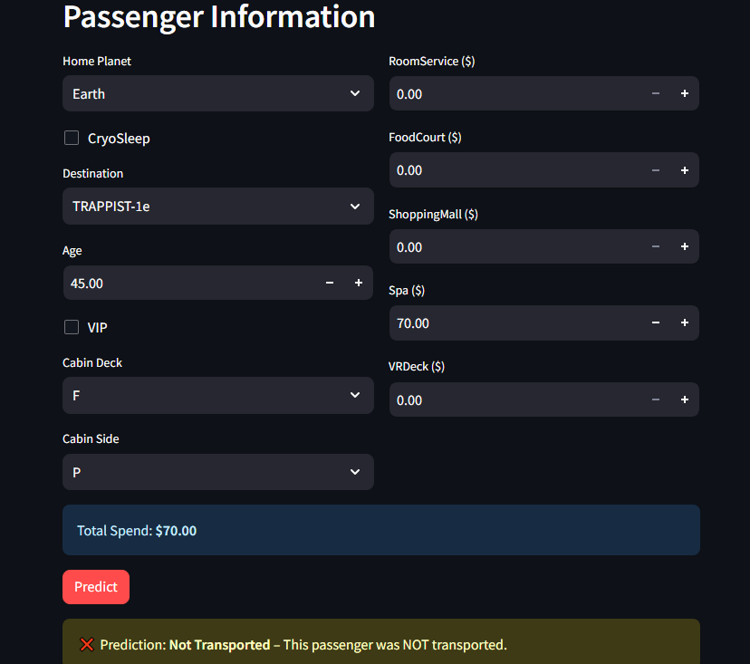

# Spaceship Titanic Classifier — SageMaker + EC2 Deployment

A machine learning classifier that predicts whether a passenger aboard the Spaceship Titanic was transported to an alternate dimension, based on personal and cabin information. This project focuses on the deployment side of the ML lifecycle: training three candidate models, packaging the winner, deploying it as a real-time inference endpoint on AWS SageMaker, and serving predictions through a Streamlit application hosted on EC2.

Note: The AWS SageMaker endpoint and EC2 instance used for this project were provisioned under an AWS Academy student account and have since been decommissioned. The screenshots below were captured using a local mock of the endpoint response to demonstrate the app's UI and prediction flow. The code remains fully functional against a real endpoint by following the deployment steps below.

---

## Preview

| Form Input | Prediction Result | Prediction Result |
|---|---|---|
|  |  |  |

---

## Architecture

```
train.csv --> pipeline.py --> model.tar.gz --> S3 --> SageMaker Endpoint --> Streamlit (EC2) --> User
```

1. `pipeline.py` trains three candidate models locally (or on a SageMaker Notebook Instance) and packages the best one.
2. `deploy_endpoint.py` uploads the packaged model to a SageMaker real-time endpoint.
3. `streamlit_app.py` calls the live endpoint via `boto3` and renders predictions in a web UI.
4. `user-data.sh` bootstraps an EC2 instance that clones this repository and runs the Streamlit app as a systemd service.

---

## Features

- **Model comparison** — Logistic Regression, Random Forest, and XGBoost trained and evaluated side by side (`pipeline.py`, `src/models.py`, `src/evaluate.py`)
- **Feature engineering** — cabin deck/side extraction, missing value imputation, total spend aggregation (`src/data.py`)
- **SageMaker deployment** — model packaging and endpoint deployment with a smoke test (`deploy_endpoint.py`, `src/inference.py`)
- **Streamlit web app** — interactive form that calls the live SageMaker endpoint (`streamlit_app.py`)
- **EC2 automation** — one-shot bootstrap script that provisions the app as a persistent systemd service (`user-data.sh`)

---

## Project Structure

```
spaceship-titanic-ml-ec2streamlit/
├── pipeline.py            # Trains 3 candidate models, saves the winner
├── deploy_endpoint.py     # Deploys model.tar.gz to a SageMaker endpoint
├── streamlit_app.py       # Streamlit UI that calls the live endpoint
├── user-data.sh           # EC2 bootstrap script (User Data)
├── train.csv              # Spaceship Titanic training dataset
├── requirements.txt
├── README.md
├── screenshots/           # App preview images
└── src/
    ├── data.py            # Load and preprocess the dataset
    ├── models.py          # Model pipeline definitions
    ├── evaluate.py        # Metrics and comparison table
    ├── inference.py       # SageMaker inference entry point
    └── requirements.txt
```

---

## Model Results

| Model | Train Accuracy | Test Accuracy | Test Macro F1 |
|---|---|---|---|
| Logistic Regression | 0.7879 | 0.7838 | 0.7837 |
| Random Forest | 0.9475 | 0.7976 | 0.7975 |
| XGBoost (winner) | 0.8658 | 0.8097 | 0.8096 |

Run `python pipeline.py` to reproduce this comparison table; the winning model is selected by test accuracy and packaged automatically.

XGBoost classification report:

```
                 precision    recall  f1-score   support

Not Transported       0.82      0.80      0.81       863
    Transported       0.80      0.82      0.81       876

       accuracy                           0.81      1739
      macro avg       0.81      0.81      0.81      1739
   weighted avg       0.81      0.81      0.81      1739
```

---

## Getting Started

### 1. Install dependencies
```bash
pip install -r requirements.txt
```

### 2. Train and package the model
Ensure `train.csv` is in the project root, then run:
```bash
python pipeline.py
```
This produces `model_artifact/model.tar.gz`.

### 3. Upload the model to S3
```bash
aws s3 mb s3://your-bucket-name --region us-east-1
aws s3 cp model_artifact/model.tar.gz s3://your-bucket-name/spaceship/model.tar.gz
```

### 4. Deploy the SageMaker endpoint
Edit the `BUCKET`, `MODEL_S3_KEY`, and `ENDPOINT_NAME` constants at the top of `deploy_endpoint.py`, then:
```bash
python deploy_endpoint.py
```

### 5. Run the Streamlit app locally (optional)
```bash
export ENDPOINT_NAME=spaceship-endpoint
export AWS_REGION=us-east-1
streamlit run streamlit_app.py
```

### 6. Deploy the app to EC2 (optional)
Edit the `GIT_REPO` and `ENDPOINT_NAME` variables at the top of `user-data.sh`, then paste its contents into the EC2 launch wizard under Advanced Details → User Data. The app will be served on port 8501 as a systemd service.

---

## Tech Stack

Python, scikit-learn, XGBoost, AWS SageMaker, boto3, Streamlit, EC2

---

## Author

**Michael Yeremia**
https://www.linkedin.com/in/michael-yeremia-3721a0360/ · https://github.com/jeraamii
